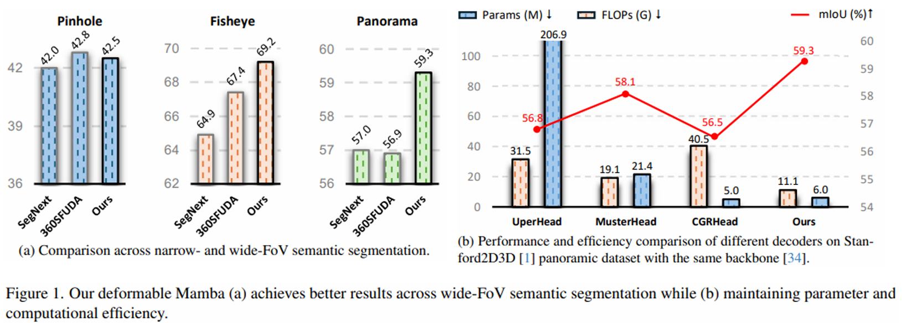

# Deformable Mamba for Wide Field of View Segmentation




## Update

<p>
<a href="https://arxiv.org/pdf/2411.16481">
    </a>
</p>
  


## Updates

- [x] [06/2025], Code is released.
- [x] [11/2024], Repository initialize.

## Prerequisites

Please make sure that your CUDA version is >= 12.1.

## Enviroments

```bash
conda create -n DMamba python=3.10.13
conda activate DMamba
cd DeformableMamba
pip install torch==2.1.1 torchvision==0.16.1 torchaudio==2.1.1 --index-url https://download.pytorch.org/whl/cu121
pip install -r requirements.txt
pip install mmcv==2.1.0 -f https://download.openmmlab.com/mmcv/dist/cu121/torch2.1/index.html
pip install mmsegmentation==1.2.2
cd mmseg/models/utils/kernels/selective_scan && pip install .
```

## Getting start
1. Prepare datasets
- [COCO-Stuff 10K](https://github.com/nightrome/cocostuff10k)
- [MP3DPANO](https://github.com/jamycheung/360BEV)
- [Stanford2D3D](https://arxiv.org/abs/1702.01105)
- [SynPASS](https://github.com/jamycheung/Trans4PASS)
- [SynWoodScape](https://github.com/valeoai/WoodScape/issues/94)
- [WoodScape](https://github.com/valeoai/WoodScape)

2. Prepare checkpoints of pretrained [backbone](https://github.com/MzeroMiko/VMamba?tab=readme-ov-file)

```
DeformableMamba
├── ckpts
│   ├── pretrained
│   │   ├── vssm-small.pt
│   │   ├── vssm-tiny.pt
│   ├── trained
├── configs
├── data
│   ├── coco_stuff10k
│   │   ├── imageLists
│   │   │   ├── train2014
│   │   │   ├── val2014
│   │   ├── annotations
│   │   │   ├── train2014
│   │   │   ├── val2014
│   ├── MP3DPANO
│   │   ├── rgb
│   │   │   ├── train
│   │   │   ├── val
│   │   ├── semantic
│   │   │   ├── train
│   │   │   ├── val
│   ├── Stanford2D3D
│   │   ├── area1_3_6
│   │   │   ├── rgb
│   │   │   ├── semantic
│   │   ├── area2_4
│   │   │   ├── rgb
│   │   │   ├── semantic
│   │   ├── area5
│   │   │   ├── rgb
│   │   │   ├── semantic
│   ├── SynPASS
│   │   ├── img
│   │   │   ├── cloud
│   │   │   ├── fog
│   │   │   ├── rain
│   │   │   ├── sun
│   │   ├── semantic
│   │   │   ├── cloud
│   │   │   ├── fog
│   │   │   ├── rain
│   │   │   ├── sun
│   ├── SynWoodScape
│   │   ├── rgb
│   │   │   ├── train
│   │   │   ├── val
│   │   ├── semantic
│   │   │   ├── train
│   │   │   ├── val
│   ├── WoodScape
│   │   ├── rgb
│   │   │   ├── train
│   │   │   ├── val
│   │   ├── semantic
│   │   │   ├── train
│   │   │   ├── val
├── mmseg
├── tools
├── requirements.txt
├── README.md
```

## Train

Please follow this command:

`bash tools/dist_train.sh <CONFIG PATH> <GPU NUM>`

For example, train the model on WoodScape dataset with 4 GPUs:

`bash tools/dist_train.sh configs/deformableMamba-mini/deformableMamba-m_woodscape_160k.py 4`

## Test

Download the trained models from [GoogleDrive](https://drive.google.com/drive/folders/1rW8M66tEdGAw_CCI2sYaM19aQFQSojHq?usp=sharing) and save in ./ckpts/trained as:

```
├── trained
│   ├── coco_stuff10k
│   │   ├── deformableMamba-mini_coco.pth
│   │   ├── deformableMamba-tiny_coco.pth
│   ├── mp3d_pano
│   │   ├── deformableMamba-mini_mp3d.pth
│   │   ├── deformableMamba-tiny_mp3d.pth
│   ├── s2d3d
│   │   ├── deformableMamba-mini_s2d3d.pth
│   │   ├── deformableMamba-tiny_s2d3d.pth
│   ├── synpass
│   │   ├── deformableMamba-mini_synpass.pth
│   │   ├── deformableMamba-tiny_synpass.pth
│   ├── synwoodscape
│   │   ├── deformableMamba-mini_synws.pth
│   │   ├── deformableMamba-tiny_synws.pth
│   ├── woodscape
│   │   ├── deformableMamba-mini_ws.pth
│   │   ├── deformableMamba-tiny_ws.pth

```

Please follow this command:


`bash tools/dist_test.sh <CONFIG PATH> <CHECKPOINT PATH> <GPU NUM>`

For example, test the model on WoodScape dataset with 4 GPUs:

`bash tools/dist_test.sh configs/deformableMamba-mini/deformableMamba-m_woodscape_160k.py ckpts/trained/synpass/deformableMamba-mini_ws.pth 4`


## References
We appreciate the previous open-source works.
- [mmsegmentation](https://github.com/open-mmlab/mmsegmentation)
- [VMamba](https://github.com/MzeroMiko/VMamba?tab=readme-ov-file)
- [Trans4PASS](https://github.com/jamycheung/Trans4PASS/tree/main)

## License

This repository is under the Apache-2.0 license. For commercial use, please contact with the authors.
